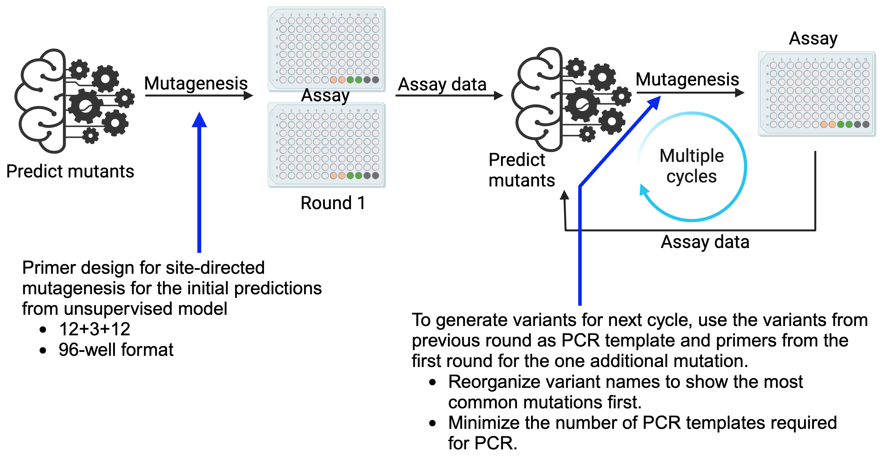

## Primer design, PCR organization, and worklist generation


### The Manuscript
This repository accompanies the work ["A Generalized Platform for Artificial Intelligence-powered Autonomous Protein Engineering"](https://www.biorxiv.org/content/10.1101/2025.02.12.637932v1).

###  PCR Primer Design and Variant Management
This repository contains a set of Python scripts designed for efficient primer design and PCR template selection across multiple rounds of continuous machine-learning guided autonomous protein engineering. Each script handles specific tasks related to mutagenesis primer design, variant naming, and PCR preparations for successive rounds.

### Repository Contents
- **Primer_Design_SDM.py**: Script for designing primers for site-directed mutagenesis (SDM) using variant names. This script needs a text file with ORF sequence and a CSV file with name of mutations. The input files need to be divided as 96 mutations per file for 96-well throughput assay. The output can be used to directly order primers in 96-well plate. <br><br>
- **Reorganize_Variant_Names.py**: This script reorganizes variant names based on frequency. It reads a CSV file of mutations predicted by the supervised learning models and sorts the mutation names according to their occurrence. <br><br>
- **Round2_PCR_Templates_Selection.py**: This script is specific for second round of PCR. For the PCR, the variants from previous round are used as PCR templates for next round. This script minimizes the number of templates needed, ensuring efficient PCR design. Tt processes input files to determine the most common variants, assigns wells in 96-well PCR plate, and generates worklists for PCR for Echo and Fluent systems. <br><br>
- **Round3_Onwards_PCRTemplate_Selection.py**: This script is similar to above but is tailored for round 3 and subsequent rounds. It calculates template requirements based on prior rounds' mutations, processes template selections, and generates worklists. 

###  Important Notes
- Each script has example input files and output files. 
- Verify constants at the beginning of the script for the correct input and output file paths.
- Ensure paths and constants are verified at the beginning of the script.
- Each script expects certain directories and files to be present in the repository root.

###  Requirements
- Python 3.x
- Libraries: `pandas`, `itertools`, `collections`, `pathlib`, `os`, `sys`, `time`

### Reference
<details>
<summary>If you use this tool, please cite us:</summary>

```bibtex
Singh, Nilmani, et al. " A Generalized Platform for Artificial Intelligence-powered Autonomous Protein Engineering." bioRxiv (2025): 2025-02.
```
</details>
