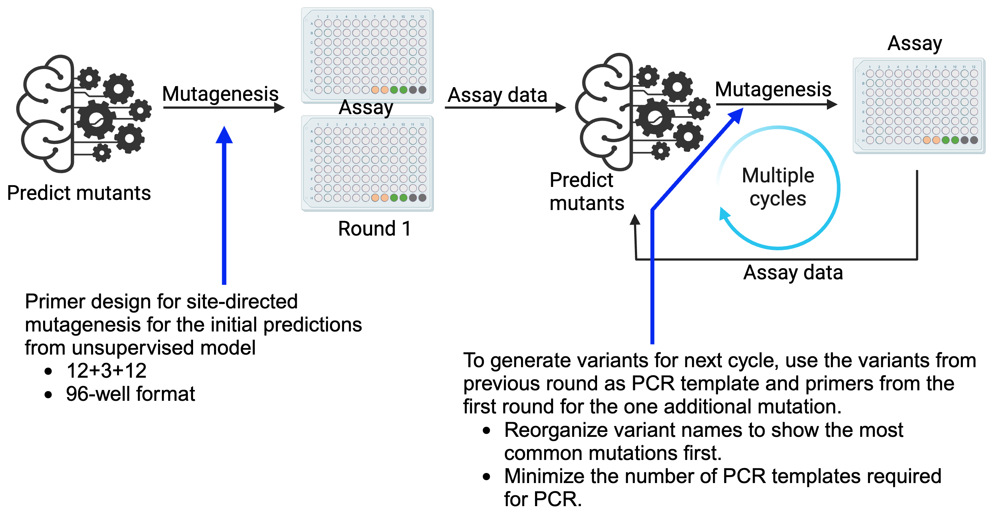

## Primer design, PCR organization, and worklist generation


### The Manuscript
This repository accompanies the work [A generalized platform for artificial intelligence-powered autonomous enzyme engineering
](https://www.nature.com/articles/s41467-025-61209-y)
<br>Please cite the reference below if you use this tool.

###  PCR Primer Design and Variant Management
This repository contains a set of Python scripts designed for efficient primer design and PCR template selection across multiple rounds of continuous machine-learning guided autonomous protein engineering. Each script handles specific tasks related to mutagenesis primer design, variant naming, and PCR preparations for successive rounds.

### Repository Contents
- **main.py**: The site-directed mutagenesis (SDM) primer designer (modular — `design.py`, `parsers.py`, `validators.py`, `codon_utils.py`). It takes a text file with the ORF sequence and a CSV of amino-acid substitutions (one per row, under a `Mutations` header), plus optional upstream/downstream overhang files. For each substitution it picks an optimal codon, builds forward and reverse primers, computes Tm/GC/length, flags per-primer issues (hairpins, GC/AT runs, homopolymers, repeats, high GC, Tm outliers, internal stop codons), and assigns wells across as many 96-well plates as needed. The output is a single combined CSV (`Mutations, Assembly_Fragments, Direction, Sequence, Tm, GC, Length, Alerts, Plate, Well`). This is the entrypoint used by the MMLI mutagenesis web integration. <br><br>
- **Primer_Design_SDM.py**: The earlier single-file version of the SDM primer designer, kept for reference; `main.py` (above) is the maintained modular successor. <br><br>
- **Reorganize_Variant_Names.py**: This script reorganizes variant names based on frequency. It reads a CSV file of mutations predicted by the supervised learning models and sorts the mutation names according to their occurrence. <br><br>
- **Round2_PCR_Templates_Selection.py**: This script is specific for second round of PCR. For the PCR, the variants from previous round are used as PCR templates for next round. This script minimizes the number of templates needed, ensuring efficient PCR design. It processes input files to determine the most common variants, assigns wells in 96-well PCR plate, and generates worklists for PCR for Echo and Fluent systems. <br><br>
- **Round3_Onwards_PCRTemplate_Selection.py**: This script is similar to above but is tailored for round 3 and subsequent rounds. It calculates template requirements based on prior rounds' mutations, processes template selections, and generates worklists. 

### Usage — SDM primer design (`main.py`)

```bash
python main.py \
  -orf path/to/orf.txt \           # ORF DNA sequence (no stop codon)
  -m   path/to/mutations.csv \     # CSV with a `Mutations` header, one substitution per row (e.g. K15A)
  -o   output_dir -f results.csv \ # combined results CSV
  -c   1 \                         # NCBI codon table id (default 1 = Standard)
  -tm  SantaLucia \                # melting-temperature method (SantaLucia | Wallace)
  [-left left_overhang.txt] [-right right_overhang.txt]   # optional flanks, concatenated around the ORF
```

Mutations must be **substitutions** whose original residue matches the ORF translation at the
given position (insertions/deletions are not supported). Overhangs, when provided, yield
full-length primers for mutations near the ORF termini.

###  Important Notes
- Each script has example input files and output files in associated folders. 
- Verify constants at the beginning of the script for the correct file paths.
- Each script expects certain directories and files to be present.

###  Requirements
- Python 3.x
- Libraries: `pandas`, `itertools`, `collections`, `pathlib`, `os`, `sys`, `time`

### Setup and Package Versions
We recommend using a python virtual environment or conda environment to manage python package versions

To setup with the appropriate versions, run the command:

#### pip install requirements.txt

### Docker Image
A Dockerfile is available in this repo. The image used by the MMLI mutagenesis web integration is published to `ghcr.io/ibiofoundry/mutagenesis` (built from the `h_to_args_part2` branch). An earlier reference image is also available on Docker Hub at `davidbianchi/mutagenesis:h_to_args_part2`.

### Reference
<details>
<summary>If you use this tool, please cite us:</summary>

```bibtex
Singh, Nilmani, et al. "A generalized platform for artificial intelligence-powered autonomous enzyme engineering" Nature Communications, vol 16:5648 (2025).
```
</details>
